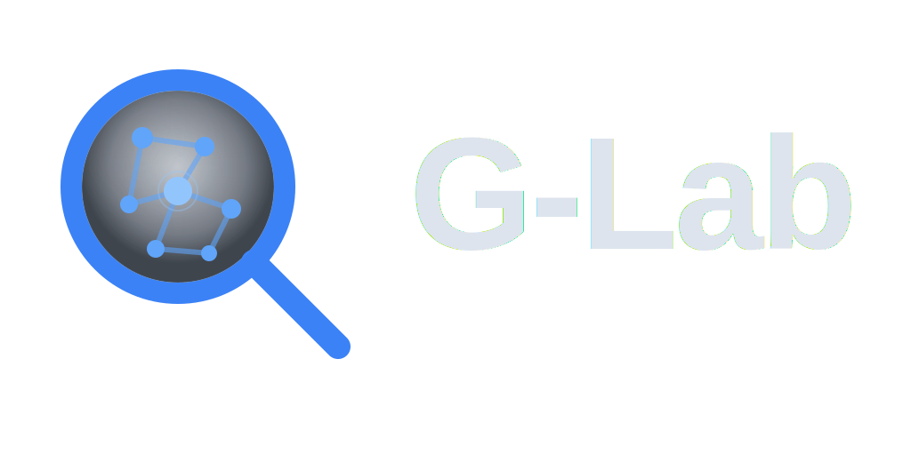

<p align="center">
  <picture>
    <source media="(prefers-color-scheme: dark)" srcset="logos/logo.svg" />
    <source media="(prefers-color-scheme: light)" srcset="logos/logo-light.svg" />
    
  </picture>
</p>

<p align="center"><strong>The graph investigation workbench that puts the power back in your hands.</strong></p>

G-Lab is a self-hosted, privacy-first environment for exploring graph databases — built for the people who dig into data that matters. Connect your Neo4j instance, pull threads on the canvas, and let the AI Copilot surface what you'd miss. Upload your own documents and watch the system cross-reference graph evidence with your source material in real time.

No cloud accounts. No telemetry. No credentials leaving your machine. Just you, your data, and a tool that stays out of the way until you need it.

---

## Contenents

- [Who It's For](#who-its-for)
- [What Makes G-Lab Different](#what-makes-g-lab-different)
- [Tech Stack](#tech-stack)
- [Prerequisites](#prerequisites)
- [Quick Start (Docker Hub)](#quick-start-docker-hub)
- [Quick Start (From Source)](#quick-start-from-source)
- [Development](#development)
- [Architecture](#architecture)
- [AI Copilot (Phase 2)](#ai-copilot-phase-2)
- [Document Library (Phase 3)](#document-library-phase-3)
- [Built With](#built-with)
- [Documentation](#documentation)
- [Contributing](#contributing)
- [License](#license)

---

## Who It's For

- **Data journalists** tracing ownership chains, mapping influence networks, and corroborating sources against leaked documents — on deadline.
- **OSINT investigators** running deep network traces, testing hypotheses against live graph data, and building cases that hold up.
- **Researchers and analysts** who need to see the connections hiding in complex datasets without sending their data to someone else's server.

---

## What Makes G-Lab Different

- **Your graph, read-only** — G-Lab never writes to your Neo4j database. Ever. Explore fearlessly.
- **AI that assists, never decides** — the Copilot proposes; you approve. Every graph mutation is user-initiated.
- **Document-grounded answers** — upload PDFs and DOCX files, and the Copilot cites them alongside graph evidence. No hallucinated sources.
- **Fully reproducible** — every action is logged, every session is exportable, every investigation can be picked up exactly where you left off.
- **Up and running in minutes** — `docker compose up` and you're investigating. Progressive disclosure means you start with the canvas and unlock AI features as you need them.
- **Privacy through architecture** — not privacy through policy. Self-hosted means self-hosted.

---

## Tech Stack

| Layer          | Technology                                     |
| -------------- | ---------------------------------------------- |
| Frontend       | React 18 + TypeScript, Vite, Zustand, Tailwind |
| Graph renderer | Cytoscape.js + CoSE-Bilkent layout             |
| UI components  | shadcn/ui                                      |
| Backend        | FastAPI (Python 3.12), Uvicorn                 |
| Graph DB       | Neo4j (user-managed, read-only connection)     |
| Session store  | SQLite (embedded, WAL mode)                    |
| LLM gateway    | OpenRouter (Phase 2)                           |
| Vector store   | ChromaDB (Phase 3)                             |

---

## Prerequisites

- Docker & Docker Compose
- A running Neo4j instance (G-Lab connects **read-only** — you manage Neo4j separately)
- Node.js 20+ and Python 3.12+ (for local development without Docker)

---

## Quick Start (Docker Hub)

The fastest way to get G-Lab running — no cloning required. Pre-built images are available on Docker Hub.

```bash
# 1. Download the compose file
curl -O https://raw.githubusercontent.com/muhanaddocker/g-lab/master/docker-compose.hub.yml

# 2. Create a .env file with your Neo4j credentials
cat > .env << EOF
NEO4J_URI=bolt://host.docker.internal:7687
NEO4J_USER=neo4j
NEO4J_PASSWORD=your-password-here
# Optional: uncomment to enable AI Copilot
# OPENROUTER_API_KEY=sk-or-...
EOF

# 3. Run
docker compose -f docker-compose.hub.yml up
```

That's it. Open **http://localhost:5173** and start investigating.

| Service  | URL                    | Image |
| -------- | ---------------------- | ----- |
| Frontend | http://localhost:5173  | `muhanaddocker/g_lab-frontend` |
| Backend  | http://localhost:8000  | `muhanaddocker/g_lab-backend`  |
| ChromaDB | http://localhost:8100  | `chromadb/chroma:0.6.3` |

---

## Quick Start (From Source)

For development or if you want to build the images yourself:

```bash
# 1. Clone the repo
git clone https://github.com/Muhanad-husn/g-lab.git && cd g-lab

# 2. Configure environment
cp .env.example .env
# Edit .env: set NEO4J_URI, NEO4J_USER, NEO4J_PASSWORD

# 3. Run (builds images locally)
docker compose up
```

| Service  | URL                    |
| -------- | ---------------------- |
| Frontend | http://localhost:5173  |
| Backend  | http://localhost:8000  |

---

## Development

```bash
# Backend — lint, type-check, tests
cd backend
ruff check app/ --fix && ruff format app/
mypy app/
pytest tests/unit/ -x -v

# Frontend — lint, type-check, tests
cd frontend
npx eslint src/ --fix && npx prettier --write src/
npx tsc --noEmit
npm test -- --run

# E2E
docker compose -f docker-compose.test.yml up
```

---

## Architecture

```
┌──────────────────────────────────────────────────────┐
│  Host Machine (Docker Compose)                       │
│                                                      │
│  Frontend :5173 ──▶ Backend :8000 ──▶ Neo4j (yours) │
│                          │                           │
│                     SQLite (sessions, logs)          │
│                     ChromaDB :8100  ← Phase 3        │
│                          │                           │
│                     OpenRouter      ← Phase 2        │
└──────────────────────────────────────────────────────┘
```

Key constraints:
- Neo4j access is **read-only**. G-Lab never writes to your graph.
- All API endpoints follow the envelope format: `{ data, warnings, meta }` on success.
- Canvas hard limit: **500 nodes**.

---

## AI Copilot (Phase 2)

G-Lab includes an optional AI Copilot that can answer questions about your graph, generate Cypher queries, and propose graph expansions — all via a streaming chat panel.

### Setup

1. Get an API key from [OpenRouter](https://openrouter.ai) (free tier available).
2. Add it to your `.env`:

   ```
   OPENROUTER_API_KEY=sk-or-...
   ```

3. Restart the stack: `docker compose up`.

The Copilot status dot in the toolbar turns green when the key is valid. No key = Copilot panel disabled; the rest of G-Lab works normally.

### How It Works

| Stage       | What happens                                                         |
| ----------- | -------------------------------------------------------------------- |
| **Routing** | Classifies your query: needs graph data? needs documents?            |
| **Retrieval** | Generates and runs a safe read-only Cypher query against your Neo4j |
| **Synthesis** | Streams a grounded answer with confidence score and evidence links  |
| **Delta** | Proposes new nodes/edges to add to the canvas (Accept or Discard)   |

Re-retrieval triggers automatically if confidence is below 40%.

### Presets & Advanced Mode

Presets bundle model assignments and token budgets. Three system presets are seeded at startup:

| Preset      | Router model         | Synthesis model       | Use case             |
| ----------- | -------------------- | --------------------- | -------------------- |
| **Fast**    | claude-3-haiku       | claude-3-haiku        | Quick questions       |
| **Balanced**| claude-3-haiku       | claude-3-sonnet       | Default              |
| **Thorough**| claude-3-sonnet      | claude-3-opus         | Deep investigations  |

Toggle **Advanced Mode** in the toolbar to assign individual models per pipeline stage and tune token budgets.

---

## Document Library (Phase 3)

G-Lab can ground Copilot answers in your own documents — PDFs and DOCX files stored locally in ChromaDB.

### Setup

ChromaDB is included in `docker-compose.yml` and starts automatically. No additional configuration is required for the default setup.

| Service  | URL                   |
| -------- | --------------------- |
| ChromaDB | http://localhost:8100 |

The vector store status dot in the toolbar turns green when ChromaDB is reachable.

### Supported File Types

| Format | Extensions         |
| ------ | ------------------ |
| PDF    | `.pdf`             |
| Word   | `.docx`            |

Maximum upload size: **50 MB** per file. Maximum **100 documents** per library.

### Parse Quality Tiers

Documents are parsed in tier order — highest quality first, falling back automatically:

| Tier         | Library            | Quality | Use case                             |
| ------------ | ------------------ | ------- | ------------------------------------ |
| **high**     | docling            | Best    | Structured PDFs with headings/tables |
| **standard** | unstructured       | Good    | General PDFs and DOCX files          |
| **basic**    | PyPDF2/python-docx | Fast    | Plain text extraction fallback       |

The parse tier badge appears on each document after upload.

### Attach/Detach Workflow

1. Open the **Documents** tab in the Navigator.
2. Create a library and upload files.
3. Click **Attach** to link the library to the current session — only one library can be attached at a time.
4. Ask the Copilot a question. When it needs documents, it automatically retrieves relevant chunks, re-ranks them, and cites them alongside graph evidence.
5. Click **Detach** to stop using the library for this session.

Session exports include a `vector_manifest.json` listing the library name and document filenames (not the document contents themselves).

---

## Built With

536 backend tests. 91 frontend tests. 17 stages across 3 phases. Every line intentional.

| Phase | What shipped                                          |
| ----- | ----------------------------------------------------- |
| 1     | Core workbench — canvas, sessions, Neo4j read-only proxy, guardrails, import/export |
| 2     | AI Copilot — streaming LLM pipeline, Cypher generation, confidence scoring, re-retrieval, presets |
| 3     | Document library — PDF/DOCX ingestion, tiered parsing, vector search, cross-encoder reranking, document-grounded answers |

---

## Documentation

| Document                        | Purpose                                           |
| ------------------------------- | ------------------------------------------------- |
| `docs/PRODUCT.md`               | What G-Lab is, who it's for, UX rules             |
| `docs/ARCHITECTURE.md`          | System design, data models, API surface           |
| `docs/IMPLEMENTATION_PLAN.md`   | Granular build plan with per-run file lists       |
| `docs/STRUCTURE_PH1.md`         | Phase 1 build order and stage breakdown           |

---

## Contributing

G-Lab is open for contributions. If you work with graph data and have ideas for making investigations better, we'd love to hear from you.

---

## License

[PolyForm Noncommercial 1.0.0](LICENSE.md) — free for personal, research, educational, and non-profit use. Commercial use requires a separate license.
